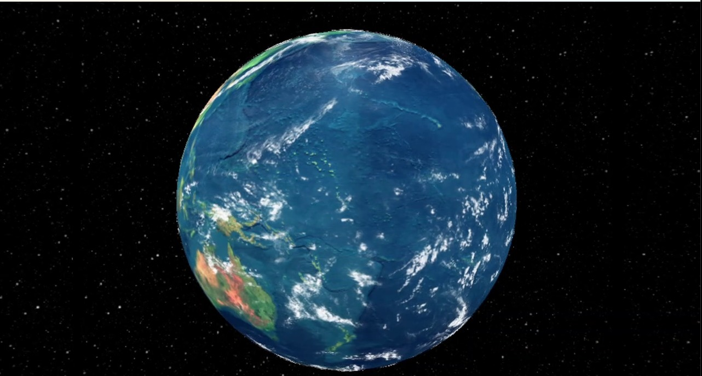
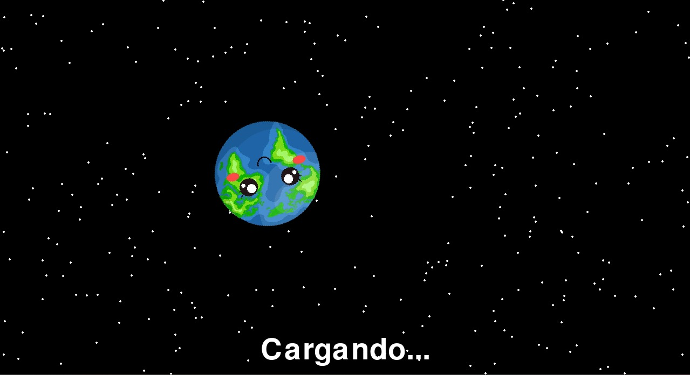
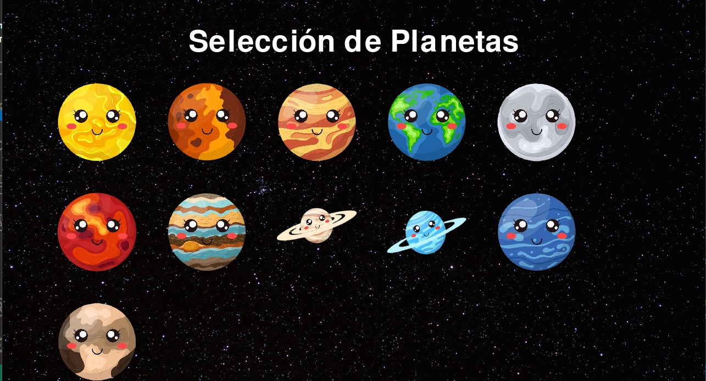

# Planetary_Tourism_Office
El siguiente repositorio corresponde a un proyecto desarrollado durante un hackathon organizado por la NASA. En este evento, se abordó la problemática de la creación de una oficina turística espacial.

