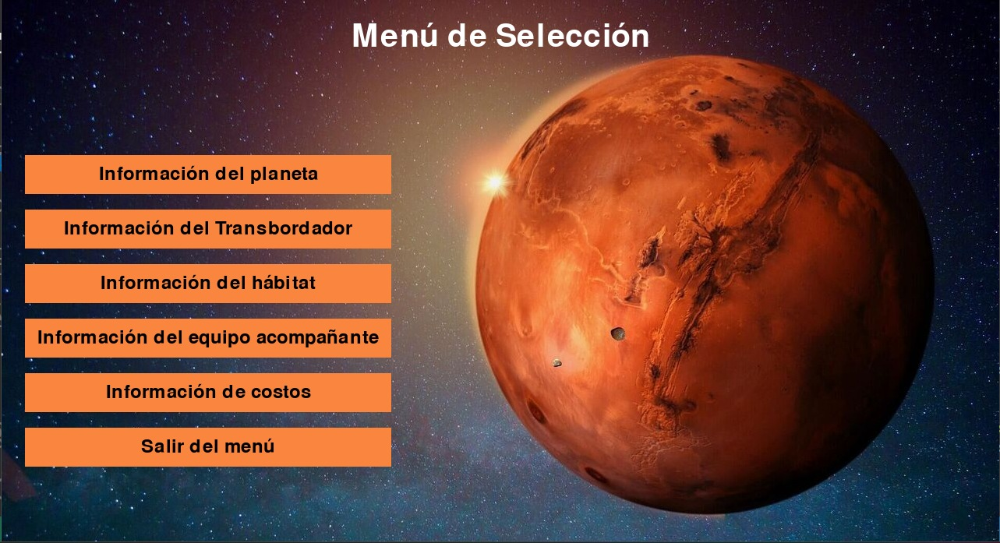
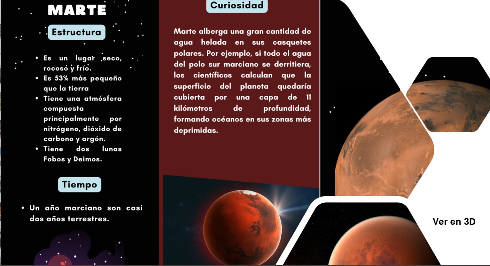
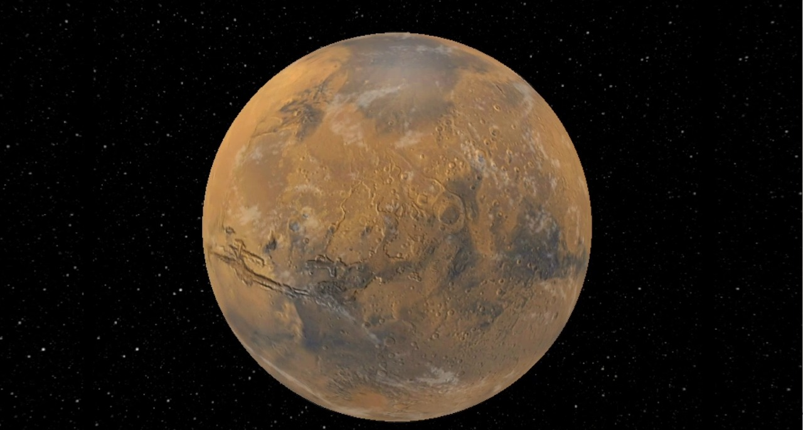
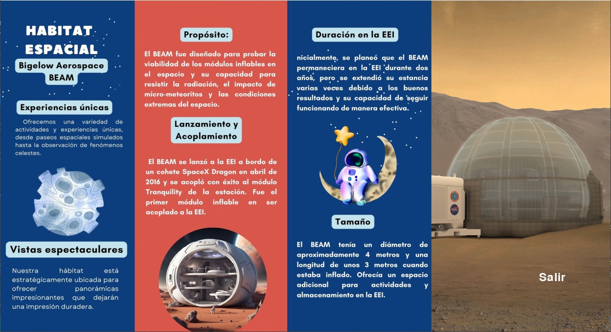

# Planetary_Tourism_Office
El siguiente repositorio corresponde a un proyecto desarrollado durante un hackathon organizado por la NASA. En este evento, se abordó la problemática de la creación de una oficina turística espacial.

# Como ejecutar la aplicacion 
1. Instalar python 
2. Instalar libreria pygame 
    1. pip install pygame
    2. pip install opencv-python

# Autores
[Aquiles Piña Olvera Lic Ciencias de la informtica IPN](https://github.com/Aquilespina)

[Josmar Palomino Castelan  Lic Ciencias de la informtica IPN ](https://github.com/Josmar360)

[Diana Tamara Panama Sanchez Lic Ciencias de la informtica IPN ](https://github.com/tammy275)

[Cristian Saúl Rodríguez Ramos   Ing Control y Automatizacion IPN ](https://github.com/saulrodriguezsk)

[Cintia Roque Moreno   Biologa  UNAM ](https://github.com/Cintiaroque)

